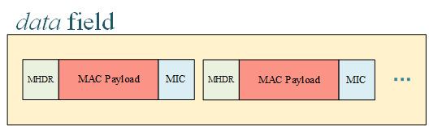

## Connector

The LoRa™ network connector serves as the entrance of the whole X-LoRa system.

### Functions

* **Gateway Connections**

   LoRa™ gateways directly connect to LoRa™ network connector and upload and download data for LoRa™ devices. The format of packages follows the Gateway to Server Interface Definition by Semtech™ Corporation, which can be referred in [Interaction with LoRa™ Gateways Section](#interaction-with-loratm-gateways). The communications are carried on UDP. Connector will record two UDP ports for gateways separately, i.e., *pull port* and *push port*, after receiving corresponding type of data. Further downlink data is sent to the matching port. 

* **Package Encapsulation and De-capsulation**

   One of the main jobs of LoRa™ network connector is to parse and encapsulate packages received from LoRa™ Gateways. Data from LoRa™ devices are kept in *data* field as an array in gateway packages. These data are byte sequences originally and encoded in *base64* format before uploading. The illustration below shows how the data of devices are packaged.

   

   After receiving packages from gateways, connector needs to extract device data from data field and decode each element with base64. Then, each data is parsed by bytes according to the message type that is come up with the MHDR field. All message types defined in LoRaWAN™ 1.1 are well supported. After each field is sliced, some necessary verifications are conducted, as well as decryption, which can be referred at following paragraphs. When everything’s fine, the message is published to the message queue on topic NC-pub for those subscribers interested. The message format is defined in [Interaction with LoRa™ Server Section](#interaction-with-loratm-server). 

   The LoRa™ network connector has also subscribed a topic named *NC-sub* where it can receive downlink messages for LoRa™ devices and encapsulate them to byte sequences. During this process, the messages are encrypted and the *MIC* is calculated. Then, the messages are encoded by *base64* and inserted into the *data* field of the JSON document for gateways. This kind of messages is called *PULL_RESP*, and forwarded to the *pull port* of gateways over UDP.

* **Verification**

   LoRa™ network connector is responsible for necessary message verifications and prevent illegal messages from entering the systems. All checks are listed below for clarity.

   |      Item       |            Further Description            |      Action       |
   | :-------------: | :---------------------------------------: | :---------------: |
   |  MIC Mismatch   |              Data corruption              |      Discard      |
   | Identify Error  |     Device or gateway does not exist      |      Discard      |
   | Illegal Format  | Message is not assembled in standard way  |      Discard      |
   | Out of Boundary |      Data exceed the maximum length       |      Discard      |
   |   FCnt Error    | The count of message frames is discordant | Discard or Ignore |

* **Security**

   LoRa™ network connector needs to encrypt and decrypt data to ensure privacy. The detailed processes of encryption and decryption can be found in LoRaWAN™ 1.0.2 standard. Connector is strictly stick to the standard to guarantee it accordance. Devices must make sure the root key *AppKey* is carefully saved in their hardware.

   On the other hand, the transmission between gateways and connector is transparent, which could bring security vulnerabilities. This can be fixed by conducting secured version of UDP (such as DTLS where TLS is used in UDP) both in connector side and gateway sides.

* **Load Balancing, Availablity and Throttling**

   LoRa™ network connector has also considered the performance since it is the entrance of the backend servers. Load balancing can be applied by deploying multiple connectors and proper schedule algorithms. The availability, in this way, is also kept. Throttling is required in connector to keep the vicious data flood out of the house.

### Interaction with LoRa™ Gateways

The LoRa™ network connector interacts with LoRa™ gateways with **six** types of messages in total. The detailed format can be learned from the open documents of Semtech™ Corporation. Here, we only give some brief instructions. 

The following three messages are sent from **gateway** to **connector**.

* **PULL_DATA**

   This message should be sent periodically by gateways to inform connector that the current gateway is alive. Besides, the UDP port gateway used to send PULL_DATA is recorded as *pull port*.

* **PUSH_DATA**

   This message contains a JSON object where three main kinds of data, i.e., the status of gateway itself, the status of LoRa™ device and the uplink data. The key names are *stat*, *rxpk* and *data* (inside *rxpk* field), respectively. The *rxpk* field is defined as an array so that it can contain multiple messages from different devices. This JSON object is serialized with ASCII-only characters and must not exceed 2048 octets. An example JSON object is listed below, which contains a *stat* field and one *rxpk* field. 

```json
   { rxpk:
      [ { tmst: 1545034506,
          chan: 7,
          rfch: 0,
          freq: 435.9,
          stat: 1,
          modu: 'LORA',
          datr: 'SF12BW125',
          codr: '4/5',
          lsnr: 2,
          rssi: -119,
          size: 24,
          data: 'gJbhkgAgTQCw9hsOerYkPu9D' } ],
     stat:
      { time: '2018-12-17 16:15:06 GMT',
        rxnb: 1,
        rxok: 0,
        rxfw: 0,
        ackr: 100,
        dwnb: 0,
        txnb: 0 } 
   }
```

   The UDP port used by PUSH_DATA will be marked as *push port* in connector. 

* **TX_ACK**

   This message is used to acknowledge the connector that the PULL_RESP (will be described below) message is received and some (maybe no) errors occurred.

   

The following three kinds of messages are sent from **connector** to **gateways**.

* **PULL_ACK**

   This is to acknowledge the gateways that the PULL_DATA is successfully received.

* **PUSH_ACK**

   This is to acknowledge the gateways that the PUSH_DATA is successfully received.

* **PULL_RESP**

   This kind of message is used for connector to send downlink message to gateways. It has a similar structure as *rxpk* except that the key name of JSON object is changed to *txpk* and the total length cannot exceed 1000 octets. An example PULL_RESP message is shown as follow,

```json
   {‘txpk’: {'codr': '4/5',
    'data': 'oJbhkgCjfwcGBgaWMvobrA==',
    'datr': 'SF12BW125',
    'freq': 435.9,
    'imme': False,
    'ipol': False,
    'modu': 'LORA',
    'powe': 25,
    'rfch': 0,
    'size': 16,
    'tmst': 1546035144}
   }
```

   The PULL_RESP is sent to the gateway through *pull_port*. Therefore, gateways MUST send PULL_DATA before any PULL_RESP can be received.

### Interaction with LoRa™ Server

The connector publishes its uplink data to *message queue* and receive downlink data from it. In our X-LoRa system, the LoRa™ network server is responsible for direct interaction with connector. Therefore, network server will subscribe topic *NC-pub* and publish data on topic *NC-sub*. The data exchange format between connector and network server is defined in this section. 

* **Connect to Network Server**

   Connector needs to upload all necessary and plain data to network server for further processing. In order to ensure consistency, the data format is designed the same as the LoRaWAN™ MAC payloads with each field parsed and pre-processed. On the other hand, the meta data (*stat* and *rxpk*) will also be sent without any changes. The example JSON format of an uplink message from connector is shown below,

```json
   { version: <Buffer 02>,
     token: <Buffer 93 b9>,
     identifier: <Buffer 00>,
     gatewayId: <Buffer 00 00 00 00 00 00 00 00>,
     stat:
       { time: '2018-12-17 16:43:16 GMT',
         rxnb: 1,
         rxok: 0,
         rxfw: 0,
         ackr: 100,
         dwnb: 0,
         txnb: 0 },
     rxpk:
       [ { tmst: 1545036196,
           chan: 7,
           rfch: 0,
           freq: 435.9,
           stat: 1,
           modu: 'LORA',
           datr: 'SF12BW125',
           codr: '4/5',
           lsnr: 2,
           rssi: -119,
           size: 24,
           data:
            { MHDR: { MType: 4, Major: 0 },
              MACPayload:
               { FHDR:
                  { DevAddr: <Buffer 00 92 e1 96>,
                    FCtrl: { ADR: 0, ADRACKReq: 0, ACK: 1, ClassB: 0, FOptsLen: 0 },
                    FCnt: <Buffer 00 00 00 53>,
                    FOpts: [ ] },
                 FPort: <Buffer d2>,
                 FRMPayload: <Buffer 68 65 6c 6c 6f> },
              },
           raw: 'gJbhkgAgUwDSxFa50NDuZxdj' },
       ]
   }
```

* **Network Server to Connector**

   The downlink data from network server to connector follows the same pattern so that here only gives an example for reference, 

```json
   { version: <Buffer 02>,
     token: <Buffer 3e 7d>,
     identifier: <Buffer 03>,
     gatewayId: <Buffer 00 00 00 00 00 00 00 00>,
     txpk:
      { imme: false,
        tmst: 1546036645,
        freq: 435.9,
        rfch: 0,
        powe: 25,
        datr: 'SF12BW125',
        modu: 'LORA',
        codr: '4/5',
        ipol: false,
        data:
         { MHDR: { MType: 5, Major: 0 },
           MACPayload:
            { FHDR:
               { DevAddr: <Buffer 00 92 e1 96>,
                 FCtrl: { ACK: 1, ADR: true, FPending: 0, FOptsLen: 3 },
                 FCnt: <Buffer 00 00 07 85>,
                 FOpts: [ { '06': {} }, { '06': {} }, { '06': {} },] },
              FPort: <Buffer e6> } } } }
```

---